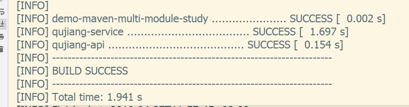
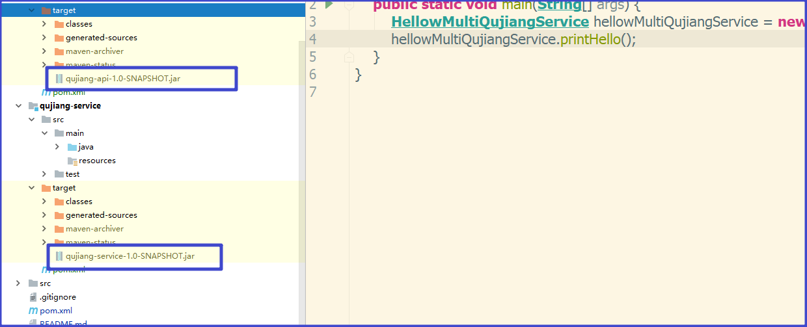
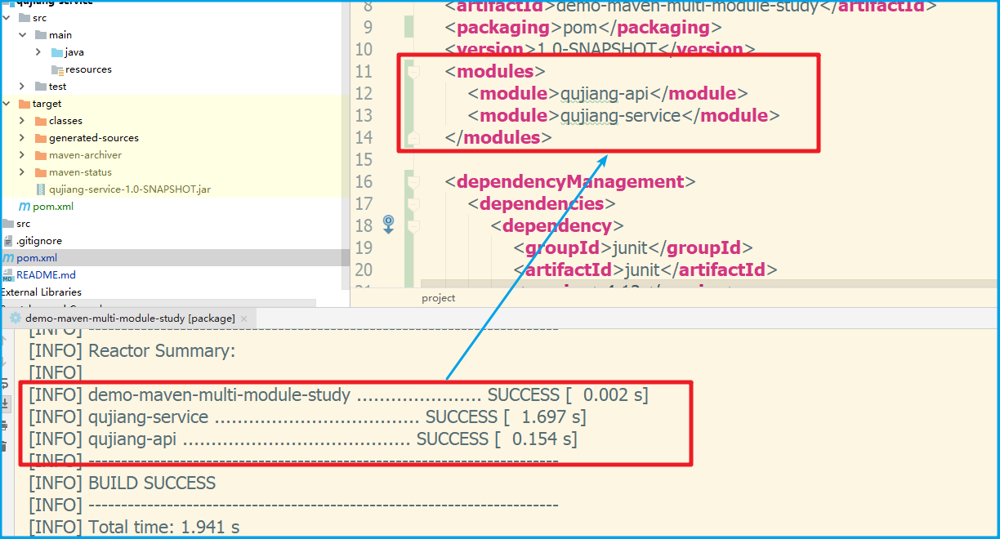
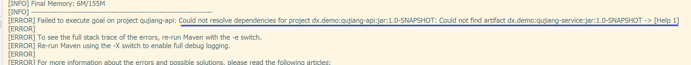

# MavenMultiModuleStudy

> 下午就要拆线了,还是蛮期待伤病归来,强拉20个引体向上的,哈哈
>
> 2019年4月27日 雨

## 前言

每个测试都会由一个对应的分支,方便查看

## 多模块的基本知识

maven中多模块肯定逃不开继承与聚合,模块的继承与聚合一般而言都是一起出现的,但是这两个功能其实是完全可以分离使用的。由于当今IDE的智能,一般会在建立子模块的时候帮我们自动处理继承与聚合,所以我们只要了解过这点就行了。

maven中,继承处理的是版本集中统一管理版本,比如test的以来不能传递,所以必然导致各个模块的test范围的依赖版本不一致。而聚合是为了基于某种规则进行集中打包。

多模块可以应用与springboot工程、将多个依赖打成一个war包的工程、将多个依赖打成一个jar包等很多灵活的工程场景。

## 这次要研究的几个问题

1. 测试maven多模块的打包顺序,主要是测试在非root工程下,是否maven会通过递归遍历的方式进行打包。现在已知的是,在modules中会根据dependencies中的依赖进行深度遍历打包。
2. 如何将多个jar包打成一个jar包。
3. 多模块打成一个war包
4. springboot工程如何多模块构建

## 场景描述

假设现在有一个曲江高新区的项目,我们准备将这个项目分为

1. demo-maven-multi-module-study---父工程
2. qujiang-api---用于存放controller层以及与接口有关的内容
3. qujiang-service---用于存放于service以及dao相关的代码

建立好的多模块工程如下

## maven多模块打包顺序的问题

可以将分支切换到"01.多模块打包顺序"

当我们通过root工程进行打包的时候

结果是喜闻乐见的。

可以看到分别将两个工程对用的jar包全构建成功了。而且自动帮我们处理了打包时的依赖顺序问题

可以看到打包时会先对root工程进行构建,毕竟我们就是通过root工程进行打包的嘛。

但是我们在通过子工程直接进行打包时会产生这样的错误

我们可以知道打包的会后会寻找坐标依赖,会先从本地仓库进行寻找,我们的本地仓库中并没有qujiang-service.jar这个jar包,所以maven报出无法解析依赖这样的错误。

**结论:无法通过聚合工程的子工程打包所有的项目。**

